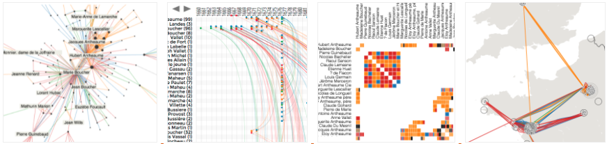

<link rel="stylesheet" type="text/css" href="assets/styles/style.css">

# Free 6-Weeks Online Course on Interactive Visual Network Exploration

[Course Material](#course-material) |  [Info Sessions](#info-sessions) | [Prerequisites and requirements](#prerequisites-and-requirements) |  [Key Information](#key-information)| [Registration](#registration) | [Course Schedule](#course-schedule) | [Who are we?](#who-are-we)| [Slack Channel](#slack-channel) | [FAQs](#faqs)

**The Vistorian team is running a *free, hands-on online course* that teaches the basics of exploring temporal, geographical, and multivariate network data (e.g., social networks) through interactive network visualizations.**
Exploratory network analysis is suitable for those working or planning to work with qualitative, quantitative, or mixed-methods research, at any stage of their research process.

We will use [The Vistorian](https://vistorian.github.io), an online tool that provides interaction visualizations for networks: **node-link diagrams, adjacency matrices, a timeline, and a map**. Each visualization provides a complementary view onto network data. This course will assist you in visual network exploration as well as in preparing your network data.

The course includes **a 2-hour session per week for 5 weeks (Jan 12-Feb 9, 2022)** and may require potentially more time at home to prepare and work with your data. 

During the course, you will learn to
1. **structure your network data** and prepare it for visualization with the Vistorian.
1. **define goals of your exploration** and what you aim to learn about your network data using visualizations.
1. **know a range of network visualizations**, through theory and hands-on use. 
1. **use different types of interactive visualizations** to explore your data.

The course combines **brief lectures** with **hands-on activities**, **discussions**, **individual support**, and networking possibilities. The course includes case-studies and discussions about exploratory network research.

**Check this websites for eventual updates and additional details**.
## Course Material

The outline and description of all weeks content can be found here [Visual Network Exploration Course Outline and Material](/visualNetworkExp.md)

Please find here the link to each session's slides:
1. Session (1): [Network Data Prepration](/networkExp_courseMaterial/INE%20Course%20_%20Week%20(1)%20Network%20Data%20Preparation.pdf)
2. Session (2): [Extra Session on Network Data Prepration](/networkExp_courseMaterial/INE%20Course%20_%20Week%20(2)%20Extra%20Session%20on%20Data%20Preparation%20.pdf)
3. Session (3): [Data Shaping Techniques and Challanges](/networkExp_courseMaterial/INE%20Course%20_%20Week%20(3)%20Data%20Shaping%20Techniques%20and%20Challenges.pdf)
4. Session (4): [Visual Exploration of Networks with Node-link Diagrams](/networkExp_courseMaterial/INE%20Course%20_%20Week%20(4)%20Exploring%20Network%20with%20Node-links.pdf)
5. Session (5): [Visual Exploration of Networks with Adjacency Matrix](/networkExp_courseMaterial/INE%20Course%20_%20Week%20(5)%20Exploring%20Network%20with%20Adjacency%20Matrix.pdf)
6. Session (6) _Last Session_: [Visual Exploration of Networks with Timeline, Map, and Parallel View](/networkExp_courseMaterial/INE%20Course%20_%20Week%20(6)%20Exploring%20Network%20with%20maps%2C%20timeline%20and%20multiview.pdf)

## Info Sessions

<<<<<<< HEAD
We run 2 **open info sessions** on 
* **Friday 10th December 2021 (4-5pm UK)**, and a repetition on 
* **Thursday 16th December 2021 (5-6pm UK)**.
=======
We run 2 **open info sessions** on  _Thursday 9th AND _Thursday 16th December from 5:00-6:00 PM UK time_. The session will walk you throught the course, demo the Vistorian, and give you the opportunity to meet us and discuss questions before signing up. [Join here](https://ed-ac-uk.zoom.us/j/83741473017). Meeting password: **qL0qfgpW**
>>>>>>> 34a8fb59c06976de1850ac10b87e026c2a38d0d0

Both sessions are the same. Each session will walk you through the course, demo the Vistorian, and give you the opportunity to meet us and discuss questions before signing up. **[Join an info session on zoom](https://ed-ac-uk.zoom.us/j/83741473017)**. **Passcode: qL0qfgpW** . To attend this info session please sign-up through this link [https://forms.office.com/r/ez0mpKSc6W](https://forms.office.com/r/ez0mpKSc6W).

_Click here to download_ the <a href="/Info%20Session%20on%20The%20Interactive%20Visual%20Network%20Exploration%20Course.pdf">Info Session Slides</a>

## Course Prerequisites and Requirements

* **No technical or programming skills** are required. The course is primarily tailored towards scholars in the humanities and those starting to explore their network data.
* **No pre-knowledge in network analysis** of terminology is required. We start with the very basics and introduce all terminology necessary for the course. 
* **We expect participants to be working with their own network** data during the course as the course will help you working with that data set. If you do not have your own dataset, we can provide you with demo data.
* Your **data should not be too large** as any visualization of large data sets is challenging in itself. An ideal size for the course is up to 500 links in your network. Ideally, your networks has fewer links to make best use of the activities and visualizations.
* **Your dataset can contain any of the following aspects:**
    * _Geographic information_ (such as place names). No coordinates are required. 
    * _Temporal information_ such as the precise time a relationship is active (e.g., a day) or their start and end date. 
    * _Multiple links between the same two two nodes_ (such as individual letters sent between two people
    * _Directed links_ (such as a letter send from person A to person B) or undirected links
    * _Weighted links_ (such as strength of a social relationship)
    * _Different types of links_ (such as different types of social relationships) 
    * _Different types of nodes_.
* **Software requirements:** 
    * No specific visualization software needs to be installed for this course. 
    * You need a web browser. Note that none of your data will be transmitted to any of our servers. Your data stays locally in your browser.
    * You also need software that allows you to edit tables such as Excel or spreadsheets in Google Drive. 

## Key Information:

* The course is **free of charge and open to everybody**. You do not have to be based in the UK. 
* We have a **limited number of 20 places**. Priority will be given to those who bring their own dataset as the course benefits will be highest (even if your data are not fully prepared and formatted).
* For **6 weeks, we meet every Wednesday from 3pm to 5pm (UK time)**.
* Each of these sessions consists of some theoretical explanations (lasting roughly 30 minutes), some hands-on activities, and time for discussion.  
* The course runs online, **using Zoom** (see link below)
* We encourage everyone to **bring their own data**.
* We **will explain how to format your data** if you want to use your own data in the subsequent sessions.
* If you do not have own data at the moment, we can provide you with demo data. However, you will get the most out of this course if you bring own data. 
* Between sessions, **there might be smaller homework tasks** to last the pace with the course (e.g., complete data cleaning, complete data formatting, upload your data into the Vistorian, etc.). We suggest reserving the necessary time for these tasks before committing to the course as the course has a limited number of places and we want every participant to take full advantage of the course. The time you want to allocate will depend on what it takes you to properly format your data within a table such as Excel.

## Course Registration

* The registration link will take you to a form which will take between 5-15min to complete: [click here to register](https://forms.office.com/r/qAnvASgRyJ). The requested information is important for us to prioritize the detailed course contents and methods.
* Applicants who have their own data to visualize will be prioritized.
* The course might be offered again in future, depending on demand and funding support. 
* By registering to the course you:
    * must consent to the ethics form provided in the registration form.
    * plan to attend to all 5 sessions.
    * ensure that you have read all of the key information mentioned above.

## What to Prepare Before the Course? 

* You should have a dataset that you want to visualize. Ideally, this data set is already formatted in some machine readable format such as a table in Excel or a CSV file. However, this is not a requirement as we will teach you how to format your data.
* We would ask each participant to prepare **a 3 mintues pitch to introduce themselves** to the other participants and the course organisers. Please prepare around 3 slides with the following information
  * Your general background and research
  * The data set you are working with (we acknowledge that you may not want to disclose too much information about this. In that case, keep this part short and high level)
  * Any challenges you have faced working with the data set (e.g., previous tools you have used) and your specific research questions. 

## Course Schedule

Session zoom link: [https://ed-ac-uk.zoom.us/j/82222194588](https://ed-ac-uk.zoom.us/j/82222194588)
PW: uB1kNvB4

### Week 1 : Network Data Preparation _12th Jan 2022_, covers the following topics:
* Role of Visualizations in Network Exploration
* Set of exercises and hands-on experience to help you defining what is the network in your data and what are your research questions:
  * What is your network about?
  * Your network's data model  
  * Properly formatting your data tables
* How to choose your exploration variables?

### Weeks (2-3) : **Data Shaping Techniques and Challenges** _19th/26th Jan 2022_, covers the following topics:
* Data types in your network
* Ensuring consistency of your data
* Tools to assist in checking data consistency
* Common challenges in network visualizations:
  * What if my network is too large to visualize? 
  * What if my data contains semi/unstructured data?
* Techniques in preparing your data
* Preparing your exploration plan

### Week 4 : **Visualizing and Analyzing your Data using _Nodelinks_** _2nd Feb 2022_, covers the following topics:
* Learn how to:
  * read topological structures in node-link diagrams, 
  * explore the temporal evolution of your network, 
  * multiple links, 
  * linkweight, 
  * link direction, 
  * as well as link and node types.

### Week 5 : **Visualizing and Analyzing your Data using _Matrix_** _9thnd Feb 2022_, covers the following topics:
* Learn how to read network structures from an adjacency matrix. This includes:
  * any temporal evolution of your network, 
  * multiple links, 
  * linkweight, 
  * link-direction, 
  * as well as link and node types. 
* We will also explain matrix ordering algorithms that help you reveal clusters and highly-connected nodes.

### Week 6 : **Visualizing and Analyzing your Data using Timeline, Map, and Multiple-Views** _16th Feb 2022_, covers the following topics:
* Timeline visualization:
  * How to read time arcs/dynamicego?
  * Visual encodings
  * Ordering and temporal changes
* Map visualization: 
  * What is Geographical Data?
  * Geo-exploration of data:When / Why Use a Map?
* Interaction and Multiple Views:
  * How can multiple views support my analysis in:
  * Static views
  * Interactive views

## Who are we?

If you have any questions, don't hesitate to reach out. We are a group of researchers at the VisHub, University of Edinburgh who are offering this course: 

* [Mashael AlKadi](https://www.linkedin.com/in/mashael-alkadi-%D9%85%D8%B4%D8%A7%D8%B9%D9%84-%D8%A7%D9%84%D9%82%D8%A7%D8%B6%D9%8A-a9579040/?originalSubdomain=sa/) (main contact) <a href="mailto: m.alkadi@sms.ed.ac.uk">Email us</a>, PhD Student, VisHub, University of Edinburgh
* [Benjamin Bach](https://vishub.net/bach), Lecturer, VisHub, University of Edinburgh
* [Uta Hinrichs](http://utahinrichs.de/), Reader, VisHub, University of Edinburgh
* [James Scott-Brown](http://jamesscottbrown.com/), Post-doc, VisHub, University of Edinburgh

## Slack Channel

We invite you to The Vistorian slack channel for questions, open discussions on the Vistorian and on how can we use exploratory and interactive visualizations, and updates, please join us on : <a href="https://join.slack.com/t/vistorian/shared_invite/zt-zo1w94tf-dkrbkqsRQqOTxavI3R~m_w" target="_blank" >The Vistorian Slack Channel</a> 

# FAQs

### How does the Vistorian handle my data? 
While The Vistorian is a web application, i.e., it runs in your browser, your data will remain on your machine and will not be transmitted to any other machine. Consequently, you do not need any login but also you cannot share your visualizations with colleagues. 

### Are you gathering any usage data?
Please refer to the ethics forms approved by the ethics committee at University of Edinburgh for a detailed description on how we handle your data. You can find detailed description of the ethics forms here:
* <a href="https://uoe-my.sharepoint.com/:b:/g/personal/s2002120_ed_ac_uk/EQkbeqU1UsZKtMq1BrugeFIBwBllQyMOWdFHqjD9Xz1Thg?e=aPkLi6">Participant Consent Form</a>
* <a href="https://uoe-my.sharepoint.com/:b:/g/personal/s2002120_ed_ac_uk/EUQscy2FydpHo_Dh2cCb9LgBPS7NMqcmbzxFKC9kqGgeeg?e=nEkUQE">Participant Information Sheet</a>

### If we do not download software, does that mean The Vistorian will hold and have access to our data?
The Vistorian stores all of your data on the user's own machine. As The Vistorian is a web application, i.e., it runs in your browser, your data will remain on your machine and will not be transmitted to any other machine. 

### Can The Vistorian handle data held in a GEDCOM file?
The current version does not support GEDCOM files. This feature might be added in the near future, but as a workaround GEDCOM files can be converted to CSV and used with the Vistorian.

### Can I join the course without my own dataset? Will you have a demo dataset to play with? As I minted to collect network data soon but would like to see what visualization I can do.
Yes, a demo dataset shall be provided to participants who do not have their own dataset. Priority is for those who have their own dataset to work on, however we will keep in consideration participants with/without datasets.

### Is it possible to work on a view of 1000 links of a larger graph or are there efficiency limitations elsewhere? E.g loading the graph and running algorithms on it.
The Vistorian can handle up to 5000 links graphs, what matters actually is the number of links. However, it might degrade the interactivity and response as the graph size goes up to such a number. Due the fact that all graph data is stored on the user’s machine (browser’s local storage) which has a limited space.

