<link rel="stylesheet" type="text/css" href="assets/styles/style.css">

# Getting Started

## A quick start guide:
<iframe width="560" height="315" src="https://www.youtube.com/embed/0VE5X2GS3AE" title="The Vistorian" frameborder="0" allow="accelerometer; autoplay; clipboard-write; encrypted-media; gyroscope; picture-in-picture" allowfullscreen></iframe>

 

## Demo Datasets:
* [Marie Boucher CSV File](https://drive.google.com/file/d/1Os_1D7xQEQHN_hujn8lf1qRVTwHTl8yV/view?usp=sharing)
* [les miserables CSV File](https://drive.google.com/file/d/11cSkZ9TYX7B1mq8gSIuKwEjahlEEmRH8/view?usp=sharing)
* [Marie Boucher Bookmarks Sample JSON File](https://drive.google.com/file/d/1JcKxDLNq0_mj1-QouciMe7yHekDlmDRm/view?usp=sharing)

## Contents Table:
* [Starting with the Tutorial](#Starting-with-the-Tutorial)
* [Introducing the Vistorian & VistorianLab Interfaces](https://vistorian.github.io/vistorian_Interface.html)
* [Ensuring your data is in the correct format ](https://vistorian.github.io/formattingdata.html)
* [Loading Data](#Loading-Data)
* [Extracting Geo-coordinates](#Extracting-Geo-coordinates)
* [A Step-by-Step Guide to Create your First set of Visualizations and Bookmarks](#A-Step-by-Step-Guide-to-Create-your-First-set-of-Visualizations-and-Bookmarks)

## Starting with the Tutorial 
1. Install Chrome: https://www.google.com/chrome. Vistorian will run on other browsers but we have not tested and optimized for other browsers.
2. Get the tutorial data [marieboucher.csv](  https://docs.google.com/spreadsheets/d/1sv2jakoxfNYPtqsQ5kI7SuzDBlW10xMwwiVSNVg2jD4/edit#gid=1326995075) or any other [demo data offered here](#demo-datasets).
3. Go to The Vistorian: http://vistorian.net
 
## Loading Data
This small tutorial will walk explain how to load data and visualize them. The demo network (see below) is a social network based on letter correspondences. The following walks through:

* how the data is formatted
* How to import data, and
* how you can explore it using the various interactive visualizations

### Network representation of the data
The input data file marieboucher.csv is an edge list format. All files imported into Vistorian must be in csv format. This means that each row is representing an edge (or relationship) between a pair of nodes. 

Our file has the following columns:
* **Sender**: the node sending a letter
* **Location_sender**: the location the sending person was when writing the letter
* **Receiver**: the person receiving the letter
* **Location_recipient**: the location the receiving person was when receiving the letter
* **Qualification**: a type of letter, i.e. content.
* **Date**: the date the letter was written (sent).
 

Opening the file in google sheets or Excel shows the following:

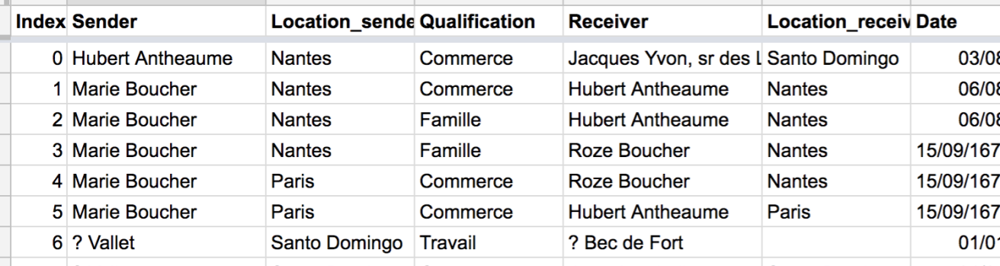

For more information on data formatting and tables in Vistorian, see [here](https://vistorian.github.io/formattingdata.html).

 

### Import data
This section explains how to import (load) data into the Vistorian. The Vistorian will not upload any of your data onto any server. Instead, the data is stored in your browser and can be deleted by flashing the browser cache (https://www.technipages.com/google-chrome-clear-cache). Data is stored persistently for after reopening the browser and restarting your machine.

1. Open Google Chrome and get to http://vistorian.net

     

2. To explore a new network or continue with a previously imported one, click on ‘My Session’ at the top of the home page (symbol has changed).

    

3. A new tab will open in your browser with the Data view. This view is your main platform for managing your uploaded data. On the left you see two lists: networks and tables. The Network list contains your networks, the table list contains an entry for every data file you uploaded. (some networks can consist of more than two tables; and the same table can be used across several networks.). On the top, you see links to the respective visualizations.

    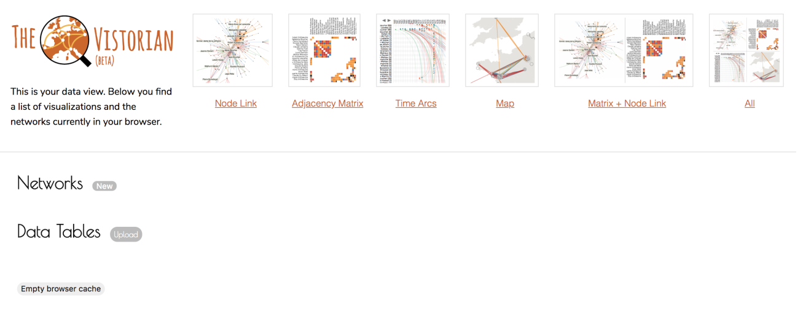

4. To upload data for a new network, click the ‘new’ button next to the Network list. This will initiate an empty network. The text on the orange background tells you that your network is not ready for visualization yet. You also see two gray boxes labeled NodeTable and and LinkTable.

    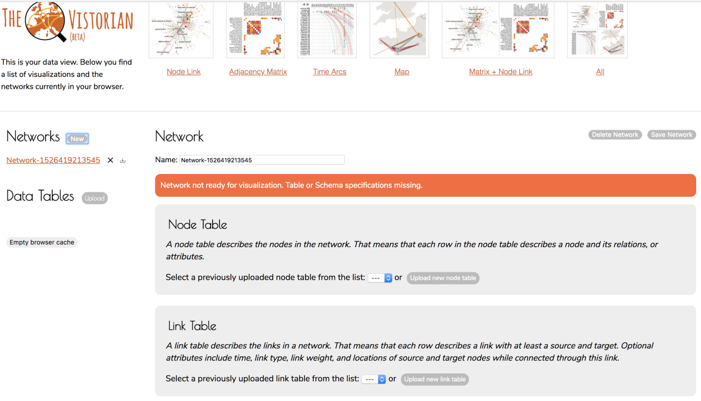

5. Since our demo data is in link table format, click no the ‘Upload new link table’ button and ignore the NodeTable box. Clicking the button opens a menu where you can select the downloaded marieboucher.csv file. Upon upload, the following table appears:
    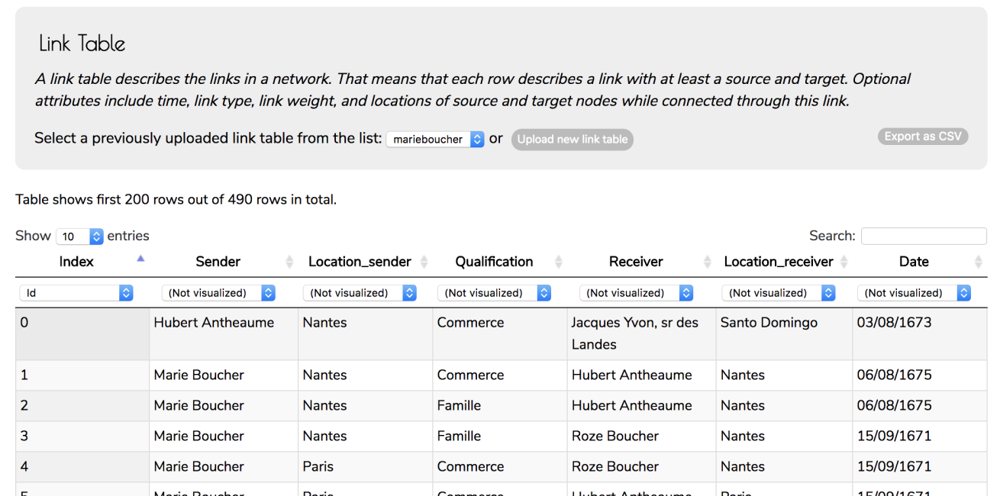

 

6. Now, you need to tell the Vistorian how to interpret that data. Therefore, select the corresponding meanings for each column from the dropdown menus above the columns:

    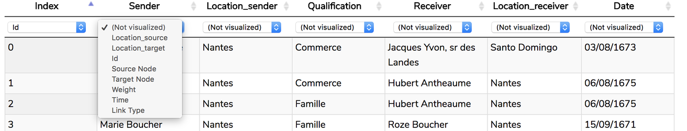

    In this example, select the following mappings:

    * Sender -> **Source Node**
    * Location_sender -> **Location_source**
    * Qualification -> **Link Type**
    * Receiver -> **Target Node**
    * Location_receiver -> **Location_target**
    * Data -> **Time**

    When you assigning the Date field, Vistorian asks you to specify the time format used in the file. This demo file uses DD/MM/YYYY.

     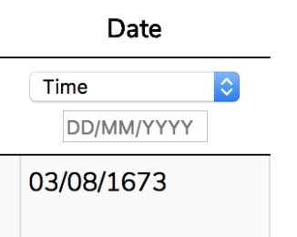 

7. Making a network in The Vistorian is as simple as that. You will notice that the message at the top of this page which earlier was coloured orange is now coloured green, stating we are ready for looking at the data.

    

8. We can first choose to give our network a particular name if we wish by modifying the title in the ‘Name’ box at the top of the page and clicking ‘Save Network on the top right. Now, click on the Node Link and check if you see the network in the new tab that opens.
    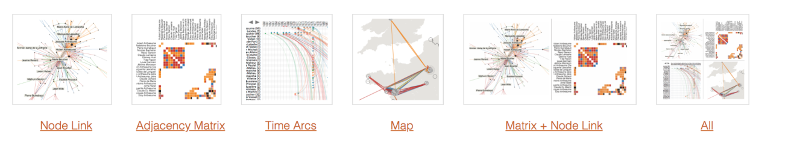

A new tab should open, showing the network like this:

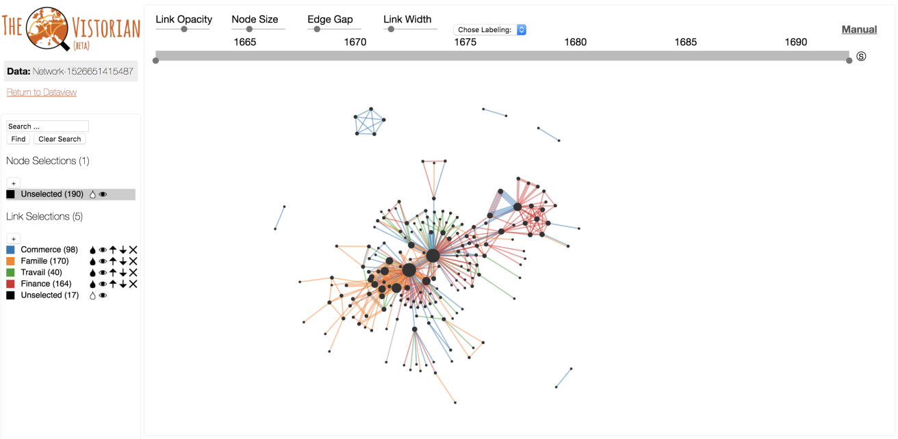

---

## Extracting Geo-coordinates

This part will show you how to deal with geographic locations in the Vistorian. The demo network (see below) is a social network based on letter correspondences. The following walks through:

* how to extract geo-coordinates
* how to fix wrong coordinates
* how to save and load existing geo locations.

See here for how to [load data into the Vistorian](#2.-Loading-Data
).

### Extracting geolocations
This tutorial assumes that geolocations are encoded as additional columns in a [link table](/formattingdata.md). In this table, every line corresponds to a link with two locations: one for each node. The table uses column names Place1 and Place2, but you can name columns in your data as you like:
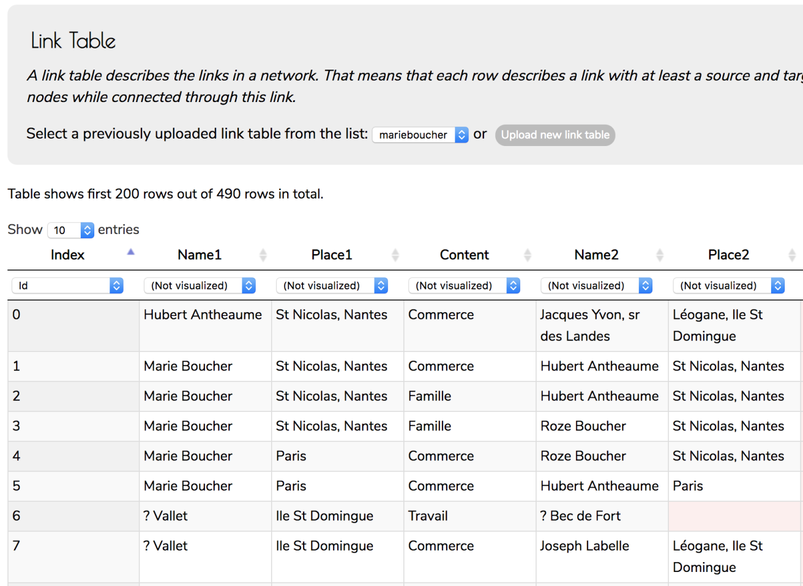

First, we tell the Vistorian which columns in our table are locations, and to which node they belong: select **Location_source** and **Location_target** from the respective dropdown menus.
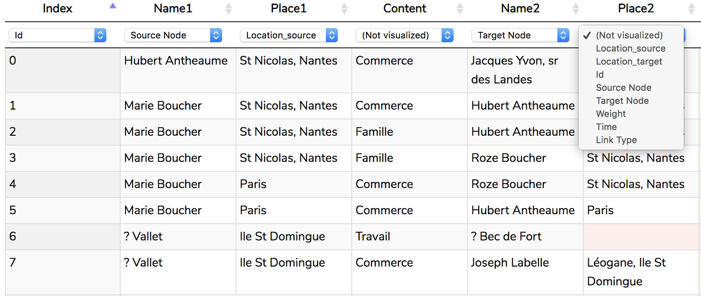

Next, scroll down the bottom of the Data View page and you realize that the Vistorian has created a new table, containing an entry of each location entry it could find in your link table. 
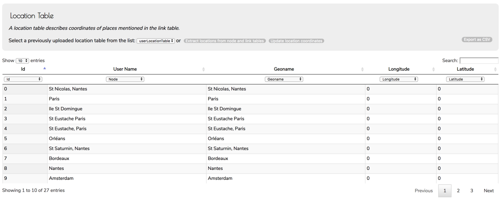

This table contains the following field:

* **Id**: a unique internal identifier. You must not edit it.
* **User name**: this the location name you have specified in your link table. This field, too, must not be touched.
* **Geoname**: this is the official location name that will be send to the geo service to obtain the coordinates. At the beginning Vistorian will populate this column with the user names. However, as some location names in your may not correspond to currently existing locations known by the geoservice, you can change geonames (see below).
* **Longitude / Latidude**: geocoordinates.

### Obtaining geo-coordinates
Once you have your location table, click the ‘Update location coordinates‘ button in the gray area just above the table.
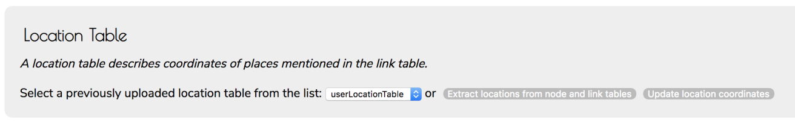

This will send your geonames to a [geoservice called Nominatim](https://nominatim.openstreetmap.org/ui/search.html) and populate the location table with coordinates where it could find the corresponding entries. Note that this time, one location has not been found: 
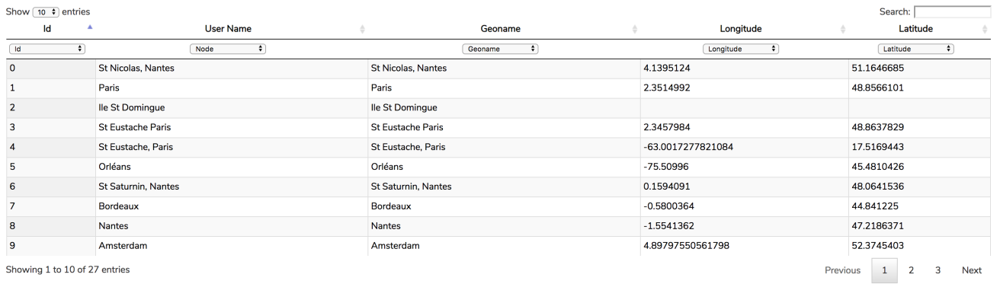

The problem here is that Ile St Domingue is the french name, while the geoservice needs english names. If you click into the geoname-field that says Ile St Domingue, change it to Santo Domingo and click again Update location coordinates. This will find the right coordinates.

### Solving ambiguous geonames
The demo data set contains some ambiguous location names such as Orléans (France, Canada) and Brest (France, Belarus). To solve ambiguity you can specify more information in the geoname column (don’t ever change the user name column as this will break your data set).

For example, for Orléans, write Orléans France, then click Update location coordinates. You will see that the coordinates have changed and that Orléans is now in France.

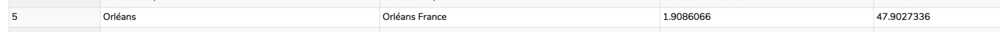

Of course, you can use the [map visualization](https://vistorian.github.io/visualizations.html/#map) to verify all your locations, then return to the data view, fix the coordinates, and reload the map visualization.

### Saving and using existing location tables
As creating clean and correct location tables can be tedious, you can export your table with the Export as CSV button at the right in the gray area.

 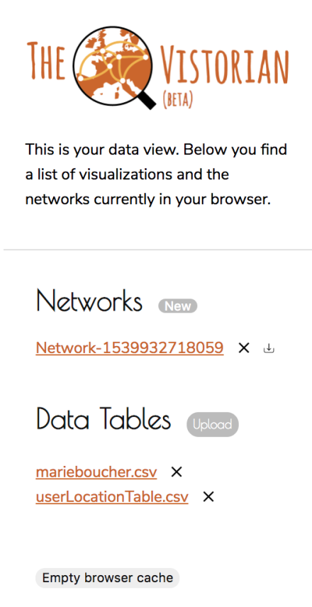 

To import an existing location table, chose Upload from the Vistorian menu, next to Data Tables (figure right). Select your csv and it will show under the Data Tables headline in the menu (e.g., userLocationTable.csv).

Next, specify the location fields in your link table (see above).

Last, chose that table in the Location Table drop down menu as shown below.

If you specify the location fields after selecting a location table, the Vistorian will create a new one. In this case, just re-select your original location table from the dropdown menu.

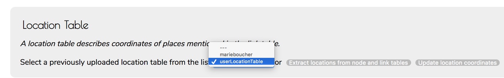

---

## A Step-by-Step Guide to Create your First set of Visualizations and Bookmarks

1. Make your **dataset** ready: Now you are set to start using the Vistorian along with the bookmarks and states: For testing purposes you can use the [MarieBoucher.csv](https://drive.google.com/file/d/1Os_1D7xQEQHN_hujn8lf1qRVTwHTl8yV/view?usp=sharing) file, a demo dataset, or any dataset of your own.  

2. Go to [The Vistorian](https://www.vistorian.net/) 

3. Start using **VistorianLab**: In the home page click on **[My Session]**. The link will open a new window with the data view page.
Switch on the **[VistorianLab toggol] button** on the left side to start creating and using bookmarks. The consent form will appear:
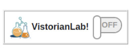 ⇒ 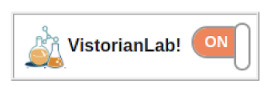 

    * Check on **[Don't show consent-approval form again]** if you wish not to see it again..
    * Download a copy of the consent form by clicking on the download link **[Download this Consent Form for your Records]**.
    * Accept the consent form by clicking on the **[Enabling Bookmarks & Logging]** button. 
    * Note: in the dataview page, you will not be able to create any bookmark as there aren’t any states to be captured/restored.

    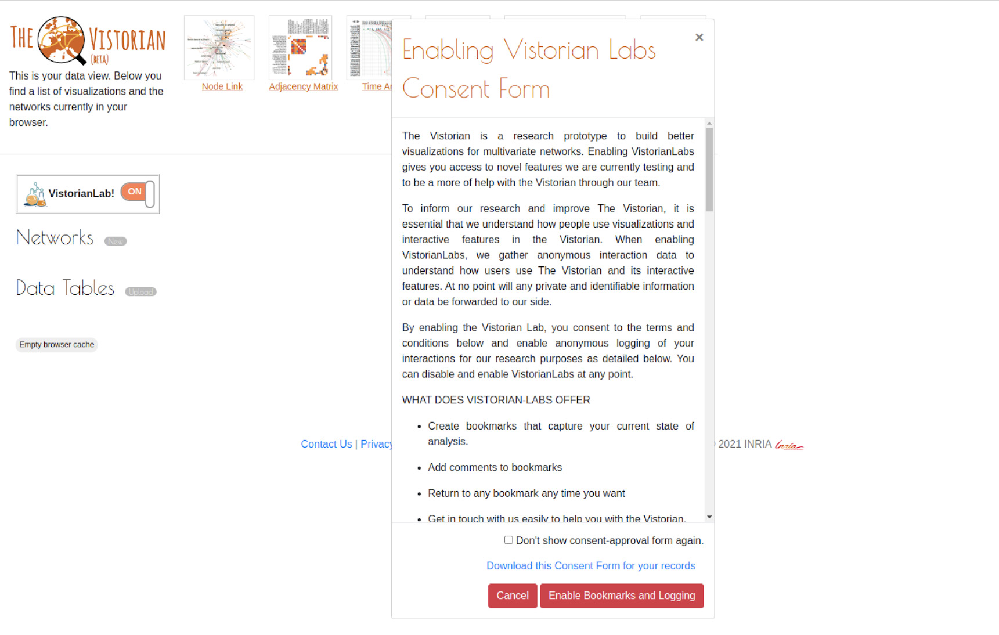 

4. **The bookmarks pane will show-up**: As a start it will show the message of (No bookmarks yet!).  You can minimize it if you wish to.
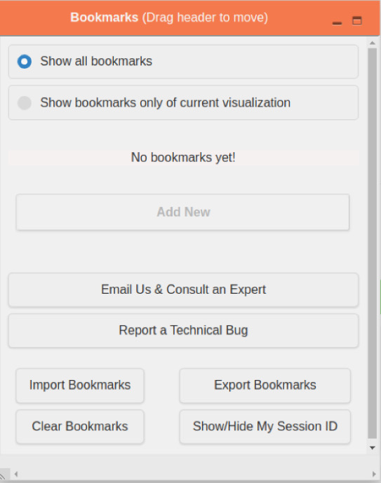 

5. **Create a new network**: Now, create a new network by clicking on the **[New]** button next to **[Networks]** section on the left side of the screen.(L)
    * Under the **Link Table**: click on the **[upload new link table]** button and select the file of MarieBoucher.csv (L)
    * In Link Table part:
        1. Describe your data by choosing the correct type for each column from the table header. From the drop-down menu select description of each column as following: 
            * For **[Name 1]**  column: select **[Source Node]** from the dropdown menu at the top of the table.
            * For **[Name 2]**  column: select **[Target Node]** from the dropdown menu at the top of the table

            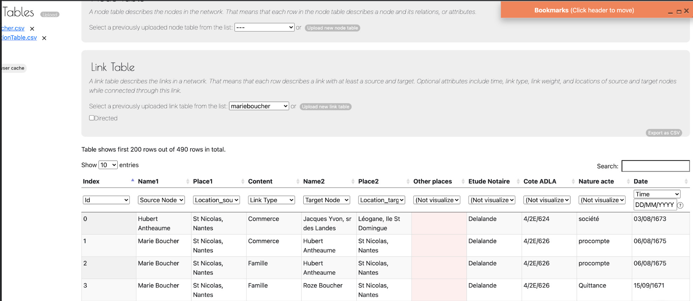 

            _As soon as you specify the source and target nodes, a green bar will show stating (Ready for visualization. Select a visualization from the menu on the top.)_

            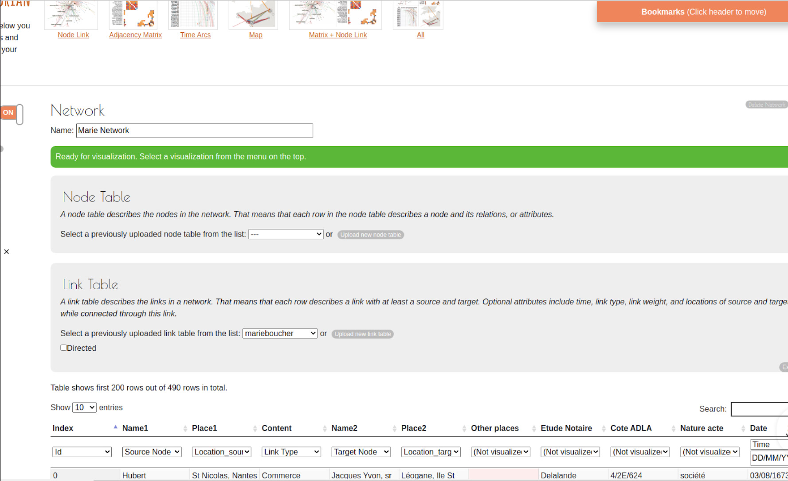 
            
            Now, continue by specifying the rest of the columns as following:
            * For **[Content]** column: select as the **[Link Type]** from dropdown menu at the top of the table
            * For **[Place 1]** column: select as the **[Location Source]**  from dropdown menu at the top of the table
            * For **[Place 2]** column: select as **[Location Target]** from dropdown menu at the top of the table
            * For **[Date]** column: select as the **[Time]** from dropdown menu at the top of the table, then specify the date format: DD/MM/YYYY

 

* Save the network by clicking the **[Save Network]** button on the top right. 
    
    >_**No personal data will be tracked. All personal files will be saved in your browser’s cache memory. Once you close your browser, your Vistorian pages/files will last in your browser’s memory until they are erased by you. Files can be erased from your browser's local memory by clicking on the [Empty browser cache] button located on the data view page.**_ (L)

6. **Changing the network name**: update the network name with any name of your choice (e.g. Marie Network) and click on **[Save Network]** button on your right side of the screen (L).
 
    * You must click on the **[Save Network]** button before creating the visualizations. If you don’t click on the **[Save Network]** button, your data might not be stored correctly. That is once you upload your data, the data will be shaped in a format that allows it to be visualized correctly. Thus, to ensure that the data’s format and/or any changes the user has made to the data/network has been stored correctly. The user should click the **[Save Network]** button.

7. **Create Node-Link network**: Now, we can create any visualized network by **clicking on any of the icons at the upper toolbar**. Select the type(s) of the visualizations/networks you would like to explore/display. You can create multiple visualizations at the same time.(L)
    * Now, we can create any visualized network by clicking on any of the icons at the upper toolbar. (e.g. Node link, matrix, ..) 
    * As start, click on the (Node Link) visualization icon on the upper part of the screen. This will open the new window of the Node Link visualization.

8. **Create your first bookmark** with the network’s initial state: Now click on **[Add New]** button to add a new bookmark or with the keyboard shortcut combination [Ctrl+Shift+A]. This will capture the initial state of your network automatically and show the  [Add New Bookmark & Log your Activity] form. Now, enter your bookmark’s description by entering the value of each field. The following values illustrates an example; you can enter your own as well: 
    1. **Title**: first bookmark 
    2. **Notes**: creating first bookmark of Nodelink network.
    3. **Characterize your current activity**: (required field) for example, choose [Analyze Data] ⇒ then, a group of checkboxes will appear, choose any of them (ex. Review Data Quality + Compare different visualizations).
    4. Then click on the **[Add Bookmark]  button**.

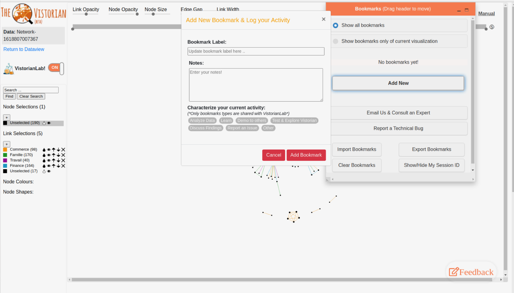 

9. It might be helpful to minimize the bookmarks pane and change its position to perform the following steps. You can do such a thing by clicking on the orange bar and dragging the pane to your preferred location.

10. **Changing Node-Link properties values**: Now, try to set the visualizations’ properties with those values as following
    * Drag start time of the timing slider: Dec 26 1674
    * Drag end time of the timing slider: Apr 26 1675
    * Drag link opacity closer to the right side, node opacity knob to the left side, and node size to the right of their slider.
    * Drag edge gap slider to the right side.
    * Drag link width slider to the most left side
    * Set the labelling type to : automatic or any of your choice.
    * Hover over link(s)/node(es) to read the nodes and links labels.

11. **Create your second bookmark**: after creating a Node Link visualization you can explore the network by playing with features provided (ex. Link opacity, Node opacity ,..). Now click on **[Add new]** button to add a new bookmark with the values : 
    1. Title: Second bookmark Dec-Apr 74-75
    2. Notes: Exploring how to work with Vistorian and bookmarks.
    3. Characterize your current activity: [Test & Explore Vistorian]
    4. Then click on the **[Add Bookmark]**  button.

12. **Setting Node-Link properties values**: Now, try to set the visualizations’ properties with those values as following
    * Drag start time of the timing slider: Nov 24 1665
    * Drag end time of the timing slider: Jul 30 1687
    * Drag link opacity, node opacity, and node size to the right of their slider.
    * Drag edge gap slider to the left side.
    * Drag link width slider to the middle
    * Set the labelling type to : automatic.
    * Hover over link(s)/node(es) to read the nodes and links labels.

13. **Create your third bookmark**: click on **[Add new]** button to add a new bookmark with the values (This will capture the initial state of your network automatically) : 
    1. Title: NodeLink bookmark 
    2. Notes:  exploring the network’s connections. 
    3. Characterize your current activity:  [Other] ⇒an additional textbox will appear, enter any type of your choice: (e.g proposing exploring methodology )
    4. Then click on the **[Add Bookmark]**  button.

    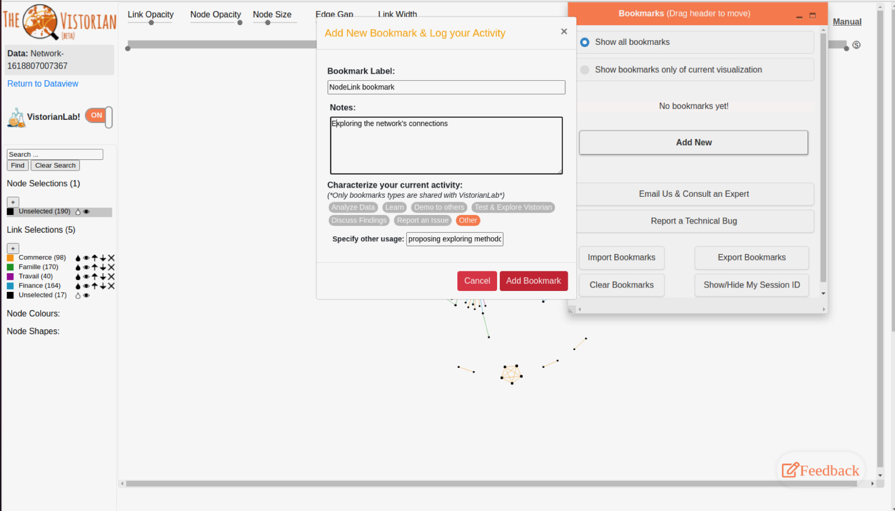
 

14. **Switching between states**: Now, try to click on the **[Restore]**   button on each of the bookmarks you have created and observe the states you have saved.

    
    You can observe and see **how the network’s state changes** each time you click the [Restore] button located in the bookmark header. This is based on the selected bookmark values such as what the following images shows:
    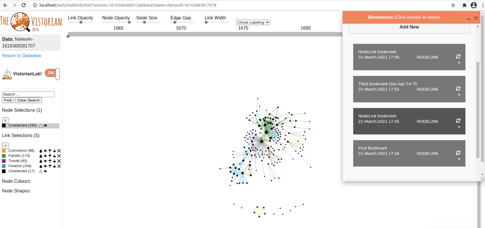
     
    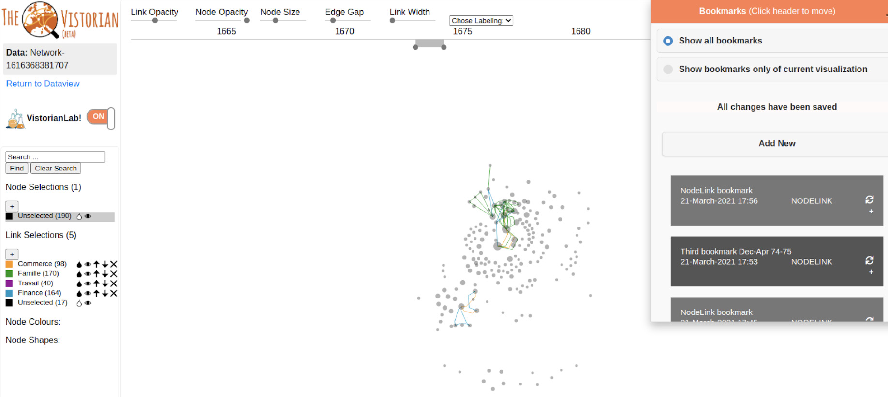
     
    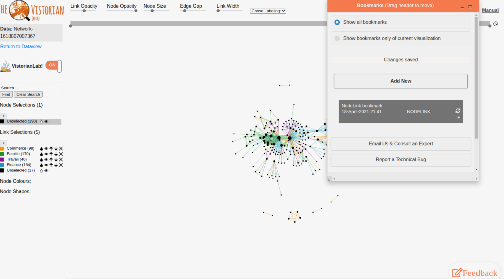

15. **Provide general feedback [Feedback] button**: on the bottom-right corner below, click on the **[Feedback]** button and provide your feedback by selecting what characterizes your work and/or written feedback.
⇒ 
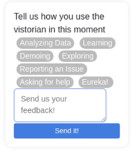
Try the following:
* Select the **type** to be : Asking for help
* Enter any feedback of your own on the textarea provided. For example, please add an exit survey to provide you with more feedback about our experience.

16. **Using the Map Visualization**:  Go back to the Vistoian "Data view" tab in your browser. In order to use the map visualization you need to:
    * Specify the source and target locations by selecting the type of the column in the dataview page. 
    * Minimize the bookmarks’ pane to have a large view of the current page.
    * Scroll down in the dataview page and click on the **[Update Location Coordinates]** button in the location table populated below.(L)
    * P.S. if longitude and latitude values don't show-up in the location table. Refresh the page by clicking on the browser’s **[Reload]** button to fill the table with the location values ias the figure below shows.
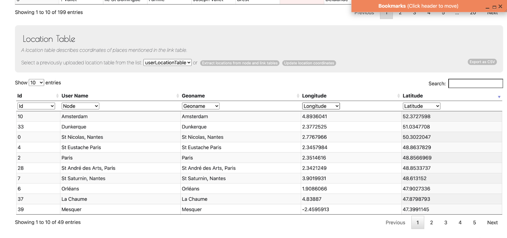
    * It will show the following screen: with a notice of (Retrieving and updating location coordinates). Click anywhere in the page and refresh the page if it doesn’t disappear and populate your location table with coordinates.
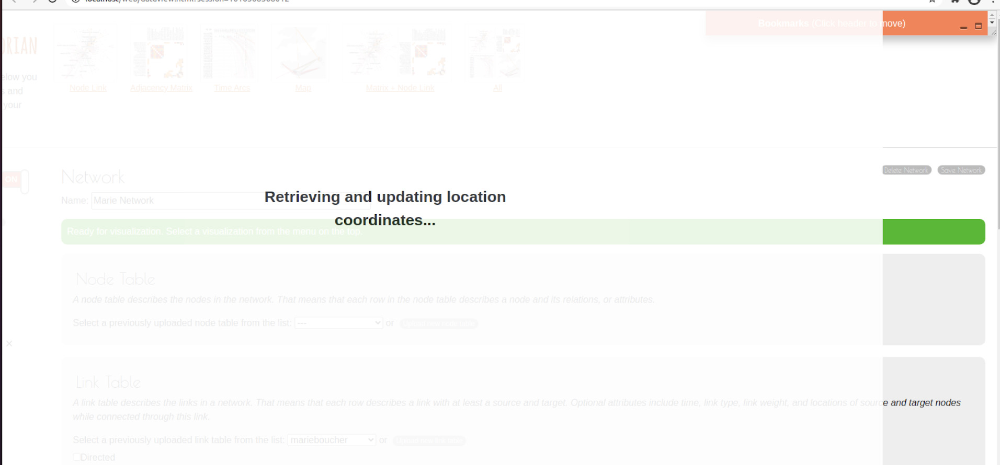

17. **Map Networks**: now click on the map link in the upper part of the dataview page. A new window will open showing your network map such as in: 
 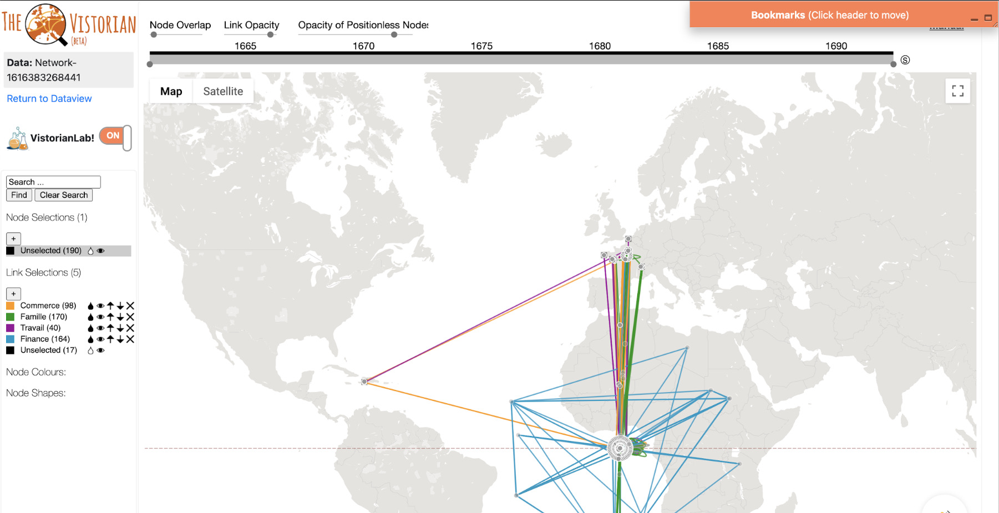

18. **Create your fourth bookmark**:  In the map network page, click on [Add new] button to add a new bookmark with the values (This will capture the initial state of your network automatically) : 
    1. Title: Map bookmark 
    2. Notes:  examining the locations and the link between nodes.
    3. Characterize your current activity: [Demo to others].
    4. Then click on the [Add Bookmark]  button.

19. **Setting Map properties values**: Now, try to set the visualizations’ properties with those values as following
Drag start time of the timing slider: Oct 04 1670
Drag end time of the timing slider: Sep 07 1680
Drag the switch of Node Overlap to the left side of the slider.
Drag the switch of the link opacity to the right side of the slider.
Drag the switch of the Opacity of Positionless Nodes to the middle of the slider.

20. **Create your fifth bookmark**: click on [Add new] button to add a new bookmark with the values (This will capture the initial state of your network automatically) : 
Title: Map from 1670 to 1680 
Notes:  correct nodes with missing cities (positionless nodes)  .
Characterize your current activity: [Report an issue].
Then click on the [Add Bookmark]  button.

The bookmarks’ pane will look something like this:

21. **Changing the bookmarks’ view**: At the top of the bookmarks’ pane you have two radio buttons that you can select from: the first one will display all of your saved bookmarks, the second one will display the bookmarks of the current view only. You can toggle between those two views at any time.(L) Try this on any of the Vistorian pages (e.g. Node-Link, map, .. )
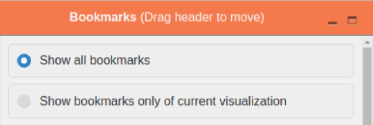

22. **Creating the TimeArchs (DynamicEgo) Visualization**: return to the dataview page and click on the Time Arcs link:
This will open a new page of the Time Arcs, you can hover over links and change the order of the labels (Choose the value of: Alphanumerical)
Set time to : Jan 1 1975 to Jan 1 1980

23. **Create your sixth bookmark**: click on **[Add new]** button to add a new bookmark with the values (This will capture the initial state of your network automatically) : 
    1. Title: Dynamic Ego 1975-1980 
    2. Notes:  order values alphanumerically.
    3. Characterize your current activity: [Analyze Data] (Check the option : Retrieve specific details) 
    4. Then click on the [Add Bookmark]  button.

24. **Click on the [Report a Technical Bug/Email Us & Consult An Expert] button**: by clicking on this button, an email template will popup through your email client. You can also use the keyboard shortcut combinations [Ctrl+Shift+U] / [Ctrl+Shift+E] to start these tasks.  Complete the email by describing your request and email us. 
    * P.S. For any further support, upon your wishes you can provide the team with the session ID. This will help to identify the log of events of your session and provide you with the suitable support upon your request and needs.

    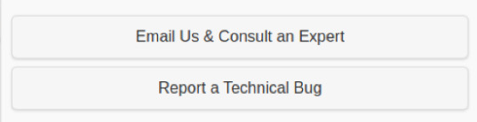

25. **Creating the Matrix Visualization**: return to the dataview page and click on the matrix  link
This will open a new page of the matrix, you can hover over links and change the:
order of the labels (Choose the value of: Node Degree)
Zoom: set the slider to middle value
Set start-end date: Jun 20 1967 to Mon 18 1964

26. **Create your seventh bookmark**: click on [Add new] button to add a new bookmark with the values (This will capture the initial state of your network automatically) : 
    1. Title: Matrix with Node Degree 
    2. Notes: examining nodes’ structure.
    3. Characterize your current activity: [Other] (and set text to : classification)
    4. Then click on the **[Add Bookmark]**  button.

27. **Export your bookmarks**: click on the **[Export Bookmarks]** button. This will automatically download a copy of your bookmarks in a JSON format file into your default download path.

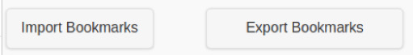

28. **Recreating the network and bookmarks**:
    1. Return to the Data view.
    2. Delete all data: by clicking on the **[Empty Browser Cache]** button (L)
    3. Activate the VistorianLab again by switching its button to on.
    4. Create a new network: by clicking on **[New]** button in the Networks section  (L)
    5. Click on upload new link table (or select form the dropdown menu if you have already uploaded your data file).(L)
    6. Click on the **[Import Bookmarks]** button: select your bookmarks file to be uploaded. This will automatically populate your bookmarks pane with your saved bookmarks values.
    7. You can download a small bookmarks sample from: click here
    
        _**P.S. Importing any file will override any existing bookmarks.**_

29. **Updating a bookmark**:
Go to the first bookmark you have created and change its type from (Learn) to (Demo to others)
Click on the **[Save Changes]** button.

30. **Deleting a bookmark**:
Go to the second bookmark you have created 
Click on the **[Delete Bookmark]** button.

31. **Creating with _Multi-view_ visualizations**: You can repeat the same steps with any other type of the visualizations offered in the data view page and play with the features offered such as:
    * NodeLink-Map visualization
    * All (Tile) visualizations 

32. **Using help resources**:
Visit the home page and explore the help resources provided such as:
    * Click on Visualization Manual link
    * Click on Demo link
    * Click on Data Formatting link
    * Click on Github link
