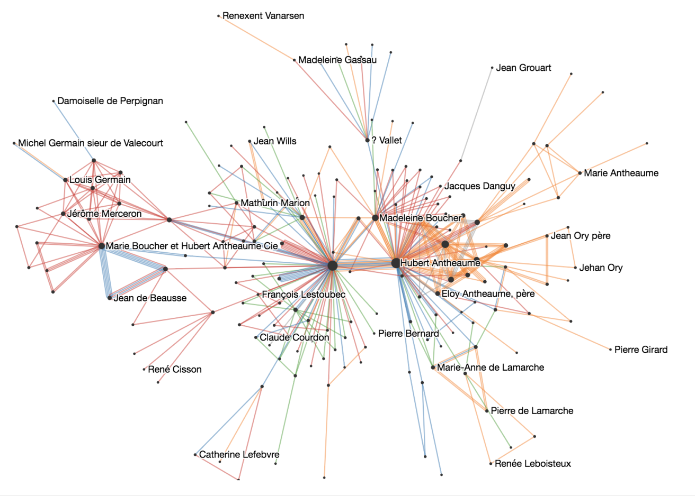

<link rel="stylesheet" type="text/css" href="assets/styles/style.css">

# The Vistorian 

[The Vistorian](http://vistorian.net) is an online tool for interactive exploration of dynamic multivariate and geographic networks. **Interactive exploration means to discover and scrutinize your data through interactive queries and multiple complementary perspectives (visualizations).** The idea of exploratory data analysis (EDA) goes back to the [American statisticiian John Tukey](https://en.wikipedia.org/wiki/John_Tukey).

_[Marie Boucher Dataset](https://hal.archives-ouvertes.fr/hal-02508730/document) Explored Using The Vistorian, courtesy of Dr. Nicole Dufournaud_

The Vistorian is a research project. If you're using the Vistorian for your work, please cite our poster and send us feedback and examples of your work of our gallery. This helps us keeping the Vistorian funded. Similarly, if you find bugs, send us screenshots and descriptions, we're happy to help you with your data.

## Why the Vistorian?

The Vistorian provides four [interactive visualizations](visualizations.html) to help you explore your networks: 
* [Node-link diagram](visualizations.html#node-link): shows networks in the traditional force-directed layout.
* [Adjacency matrix](visualizations.html#adjacency-matrix): shows your network in a compact table format to help visulize very dense networks.
* [Timeline](visualizations.html#time-arcs): shows you network over time
* [Map](visualizations.html#map): shows your network on an interactive map.

<iframe width="560" height="315" src="https://www.youtube.com/embed/0VE5X2GS3AE" title="The Vistorian" frameborder="0" allow="accelerometer; autoplay; clipboard-write; encrypted-media; gyroscope; picture-in-picture" allowfullscreen></iframe>    

## What kinds of networks does it visualize?
The Vistorian provides visualiztions for the following data in networks:

 

## Upload data in simple CSV

Your data needs to be formatted in tables like shown below. All your data will remain securly on your machine. No data will be send to our server. 
 

Learn more about [formatting data for The Vistorian](formattingdata).

## Learn

We provide [detailed tutorials](gettingstarted.html) as well as a [live workshops](tutorials.html).

## Cite the Vistorian
`Benjamin Bach, Nathalie Henry Riche, Roland Fernandez, Emmanoulis Giannisakis, Bongshin Lee, Jean-Daniel Fekete. NetworkCube: Bringing Dynamic Network Visualizations to Domain Scientists. Posters of the Conference on Information Visualization (InfoVis), Oct 2015, Chicago, United States. 2015.`

## Support

The Vistorian is an ongoing reserch project. It is open source. If you wish to contribute or find issues, get in contact with us.

* Contact: [vistorian@inria.fr](vistorian@inria.fr)
* sign up for the mailing List: vistorian@googlegroups.com
