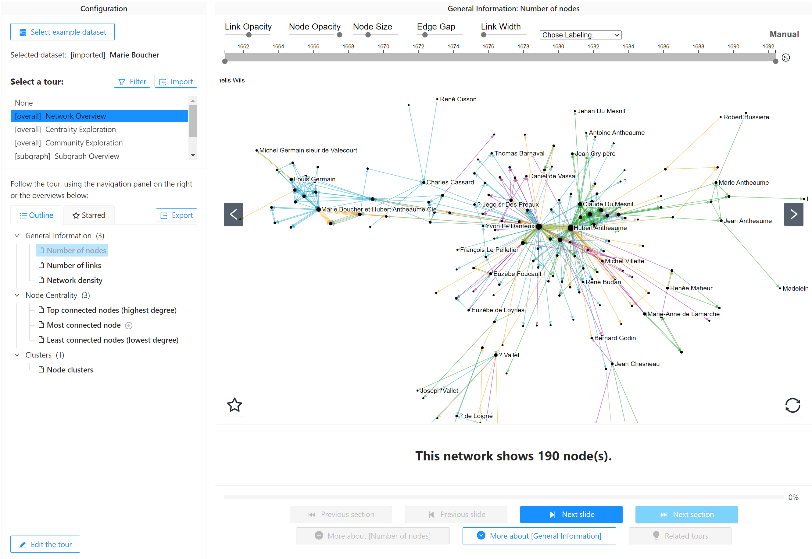
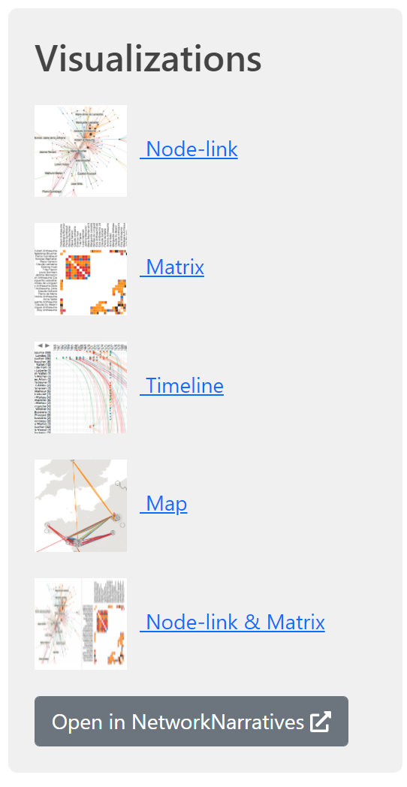

# Guided Tours with Network Narratives

NetworkNarratives is a Vistorian modules that provides a set of **automatically generated guided tours** in the form of annotated slideshows to help you exploring your network. Chosing from a set of **[tours](networknarratives/tours)** (e.g., Network Overview, Egonetwork Exploration, etc.), NetworkNarratives creates a slideshow with text captions as if someone would give you talk about your network. With simple linear navigation (next slide, previous slide), you can navigate the slideshow and learn about your network.

## [>> Watch the video (3:29)](https://www.youtube.com/watch?v=qbbC131ZstM)

## Launching Network Narratives

You can launch NetworkNarratives direclty from TheVistorian side menu where you launch the individual visualizations. 

## Interface

Learn more about the user interface **[here](networknarratives/userinterface)**

## Tous

Find out which **[tours](networknarratives/tours)** Network Narratives provides with.

## Help & Support 

To get a 30min introduction and help you get set with your data, please book a 30min slot on [Calenderly](https://calendly.com/js-b/network-naratives-initial-interview?month=2022-03). We will follow up for a time that is convenient for a 2nd interview. 

The [Partcicipant Information Sheet can be found here](https://docs.google.com/document/d/1t3eCX8xEGhfWX_dAsHZoTFMYa234VOZantDzy4R-RxE/edit?usp=sharing). 

