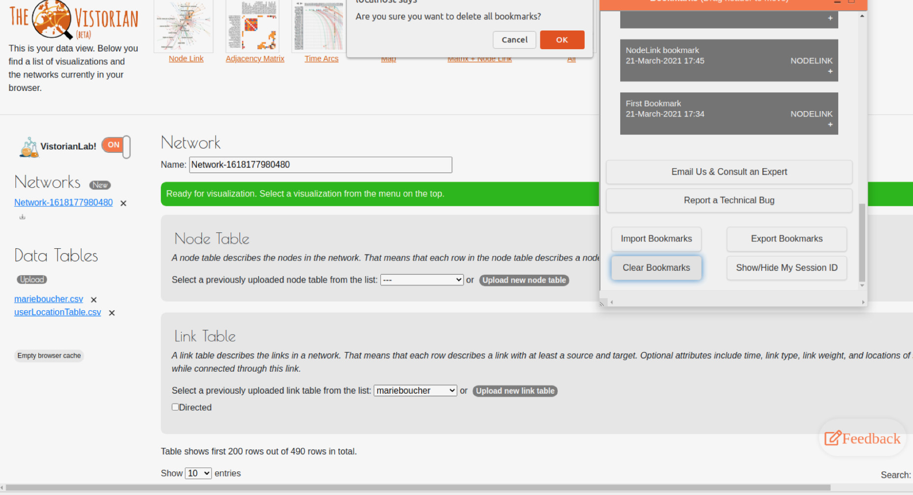
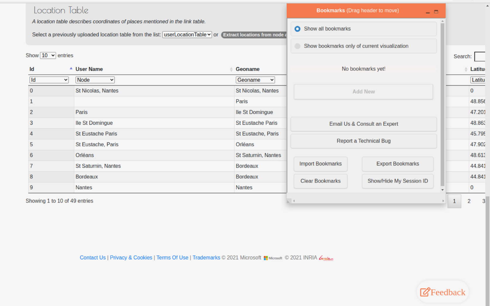
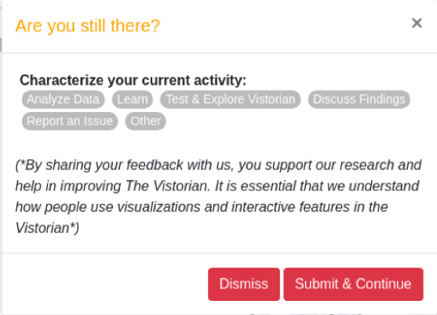

<link rel="stylesheet" type="text/css" href="assets/styles/style.css">

# Introducing the Vistorian & VistorianLab Interfaces

1. Visit https://www.vistorian.online/
2. Click on my session link. The link will open a new window with the data view page. Here you can upload your data, specify the columns that describe your data and manipulate it if needed.
3. In the data view page:
    1. **On the left side**: you can create a new network, upload a new table or empty the cache memory. By emptying the cache memory all data will be deleted including data uploaded, any bookmarks/states created through VistorianLab, and preferences of your choice that have been selected and/or saved (e.g. not to show consent form any further).
    2. **On the upper bar**: you can see the types of network visualizations that you can create after uploading your data.
    3. After clicking New network, in **the middle part**: you will be able to create any of the 3 types of tables and upload your data: (1) Node Table, (2) Link Table,  (3) Location Table.
    4. On **the right side**: after activating the VistorianLab, the bookmarks pane will appear on your right side and you will be able to create your own bookmarks and states.

4. **Activating VistorianLab**: You can start creating your own bookmarks, adding your own notes, and capturing your network states by activating the VistorianLab. To do so, switch on the **[VistorianLab toggle] button** located on your left side. This will activate the bookmarking tool and logging process.(L)
5. **VistorianLab Consent**: A consent form will be displayed for after turning on VistorianLab:
    1. You can download the consent form for your records by clicking on the download consent form link. (L)
    2. If you wish not to see the consent form any further: check the [Don't show consent-approval form again] checkbox. This will disable the display of the consent form from popping-up at any time the user turns on the VistorianLab (bookmarking tool)again. The form can be displayed at any time the user refreshes the window/clears the cache memory.(L) You can choose one of the following actions:
        * Clicking on [**Enable Bookmarks and Logging**] button: by selecting this option you can enjoy all features of the  VistorianLab and enable the logging process.
        * Clicking on [**Cancel**] : by selecting this option you will disable the VistorianLab, hide all of its features and disable the logging process.(L)

6. **VistorianLab Pane/window** :If you have chosen to Enable Bookmarks and Logging, the bookmarks window will be displayed. You can make use of any of the following components:
    1. **The header bar**: you  can relocate the bookmarks pane by moving it to any location on the window by clicking on the header bar and dragging it to any place of your choice. In addition, you can:
        * Click the [**Minimize**] button : minimizes the bookmarks pane and stick it to the top right corner.(L)
        * Click the [**Maximize**] button : maximize the bookmarks pane and restore it to the uncollapsed size.(L)

    2. **The bookmarks management part**: 
        * Bookmarks can be created by clicking on the **[Add a Bookmark]** button.
        * A window will popup to enable the user to create a new bookmark.The user will be able to enter any of the bookmark values including :
            * **Label**: the bookmark title either entered by the user or auto-assigned by the tool. If the user did not enter any value in this field, by default a label will be created and assigned. The default value holds both: an auto-incremented number as the bookmark ID and the date/time of the creation of this bookmark. (N)
            * **Network Type**: this will be auto assigned and displayed in bookmark’s header once created. The type of your network is the type of visualization you are creating (e.g. nodelink, matrix, ..)
            * **Bookmark type**: the user can select the type of their bookmark. This value is mandatory. This enables the user to classify their own bookmarks. 
                * Main types are: Analyze Data, Learn, Demo to others, Test & Explore Vistorian, Discuss Findings, Report an Issue, and other.
                * Certain types have further details to be chosen/added such as:
                    * The (Data Analysis) type: if chosen, the user will be shown a  submenu of different analysis purposes that s/he can select from.(L)
                    * The (Other) type: the user will be provided an additional textbox to enable him/her to add descriptive text about any other type of your own preference that can describe the bookmark more precisely. (L)
            * **Bookmark Notes**: this enables you to write your own notes for each bookmark to enable you to log your research and progress notes. (N)
        
        * In addition the following values will be captured and added automatically to the created bookmark:
            * the **current visualization/network state**: This includes the values of the network controls/features (e.g. zoom, labelling type, timeline values, .. etc). This will help you to restore the bookmark state whenever needed, (L)
            * the **date/time the bookmark was created**, (L)
            * the **type of the current view** (e.g. NodeLink, dataview, matrix, .. etc), (L)

        * After the creation of the bookmark, the user can update any of the editable bookmark fields including :
            * **Label**: user can change and update the title assigned to the bookmark.(N)
            * **Bookmark type**: the user can change the chosen type of the selected bookmark. 
            **Bookmark Notes**: the user can update the notes field. (N)
        * Each bookmark will have 2-3 additional buttons based on the page view they are in:
            * **[Delete bookmark] button**: enables the user to delete the bookmark being selected. This is available for all bookmarks. (L) 
            * **[Save Changes] button**: enables you to save the changes made on the bookmark (e.g change of title, type, notes) This is available for all bookmarks. (L) 
            * **[Restore  State] button**: This button appears as two-circular-arrows icon on the right most of each bookmark’s header. This enables you to restore the state of the network captured at the time of the bookmark creation. Available for all views (visualization networks) except for the data view page as no state will be captured.  (L)

    3. You can **contact us** by:
        * Clicking **[Email us and Consult an Expert] button** (L)
        * Clicking on **[Report a technical Bug] button** (L)
    
    4. **Extra options**:
        * **[Import Bookmarks] Button**: This will enable the user to import any exported file of bookmarks in a JSON format. This will enable users to exchange and view bookmarks’ notes and states with other colleagues and users. This can be done also by clicking the keyboard short combination of [Ctrl+Shift+I].
        * **[Export Bookmarks] Button**: This will enable the user to export their bookmarks as a JSON file. This will enable users to send their bookmarks and share them with other users and/or to return to them at a later time. This can be done also by clicking the keyboard short combination of [Ctrl+Shift+X].
        * **[Clear Bookmarks] Button**: This button will enable you to delete all bookmarks at once. A confirmation message will appear to ensure the user’s choice of deleting all bookmarks. This can be done also by clicking the keyboard short combination of [Ctrl+Shift+C].

        

        * **[Show/Hide Session ID] button**: this button will help you to discuss further your activity and actions’ log with the team whenever you need for a consultation, troubleshooting a problem, or if you wish to participate in the next phase of our study. You can show/hide the session ID also by clicking on keyboard shortcut combination  [Ctrl+Shift+H].

 

7. **General Feedback [Voluntary Activity Reporting] button** on the bottom right: you can tell us through this panel what you are doing and send us a general feedback at any time by clicking on the **[Feedback]** button on the right bottom corner of your page and clicking the **[Submit]** button.(L)

 

8. **Notes**:
    1. **Bookmarks’ Order**: All bookmarks will be ordered in a descending order from the newest to the oldest created one.
    2. **Bookmarks Pane Refreshing**: In case any of your bookmarks doesn’t appear, you just need to refresh the pane by reloading the page. By default, the bookmarks’ pane updates itself each time you return to a page in order to reflect any changes and synchronize its content with all other pages.
    3. **User’s Inactivity Survey**: If the user was inactive for around 5 minutes, a small survey window will pop-up similar to some of the  **[Add bookmark] panel** questions. You shall characterize your activity by specifying what you are doing. Your answer will not be added to the list of bookmarks you have created - if any -. (L) 

    

