# Visualizations

* [Node-link Diagram](#node-link-diagram)
* [Circular Node-link Diagram and Arc Diagram](#circular-node-link-diagram-and-arc-diagram)
* [Adjacency Matrix](#adjacency-matrix)
* [Time Arcs](#time-arcs)
* [Adjacent-node List](#adjacent-node-list)
* [Incident-link List](#incident-link-list)
* [Geographic Map](#geographic-map)

# Node-link Diagram

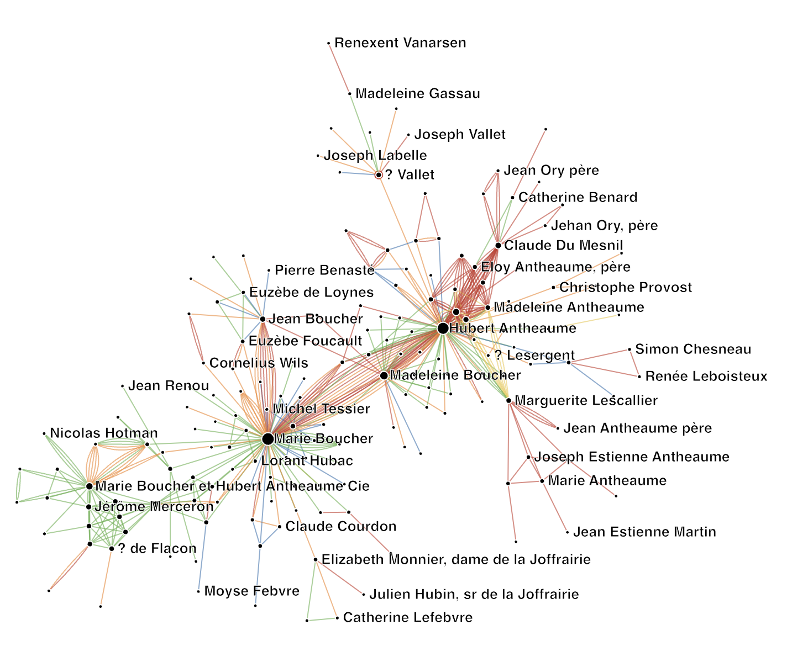

Node-link diagrams show nodes in the network as points (dots) and (multiple) relations between nodes as straight lines. Moving the time slider on the top of the visualization filters links between nodes according to their presence in time.

### Visual Encoding

Layout: The node-link diagram uses the simple default [force-directed](https://en.wikipedia.org/wiki/Force-directed_graph_drawing)  layout, implemented in [D3](https://bl.ocks.org/mbostock/4062045). Nodes with many common neighbors are drawn closer to each other, while nodes with few connections are drawn at the periphery of the layout.

Label visibility is defined by an optimization method inspired by map labeling: if two node labels visually overlap, we remove the label of the 'less important node' (approximated by a lesser degree, i.e., the number of connections). Zooming in and out will change the space available to render node labels and will be able to show labels for nodes with a lesser degree. The 

* **Node size:** Number of connections: Larger nodes indicate nodes with more connections, smaller nodes have less connections ([node degree](https://mathworld.wolfram.com/VertexDegree.html))
* **Multiple lines between nodes (optional):** this indicates multiple different relations among those nodes.
* **Line thickness (optional):** relation weight: lines of different thickness indicate relations of different strength (or weight).
* **Line color (optional):** relation type: Different colors mean different types of relation. A color legend is presented in the Browser (see below).
* **Node color or shape (optional):** node colors or shapes indicate node types. Node types show as symbols (circles, squares, crosses, etc. ) when links also do have a type and are consequently colored. If links in the network do not have color, node type is shown through colors. 

### Interaction
* **Zoom:** Move mouse wheel (or use the specific zooming gesture on your device)
* **Pan:** Drag on the empty plane with the mouse
* **Show node label** by hovering over a node
<!-- * **Fix or hide the node label** by clicking on the node -->
* **Hide/show relation type** by clicking onto the colored circle in the legend. The circle is filled if relations of that type are shown in the visualization and empty (white) when the relations of this type are not shown.
* **Style sliders:** 
    * Node size, node opacity, 
    * link width, link opacity, 
    * Label density (the number of labels being shown)
    * Label size
    * Link gap: the gap between parallel links (links between the same node pair)
* **Timeline slider** (if the data has temporal information)

<!-- ### Visual Patterns
* Relative node size 
* Link transparency
* Link width
* Gap between multiple links (between same nodes)

### Visual Patterns

Often, we look at visualizations with preconceptions. That means, we're seeing just what we want to see. That also means that we do not see new things. Exploring a network means to see new things. The network below shows letter correspondences between persons. Colors indicate types of letters.

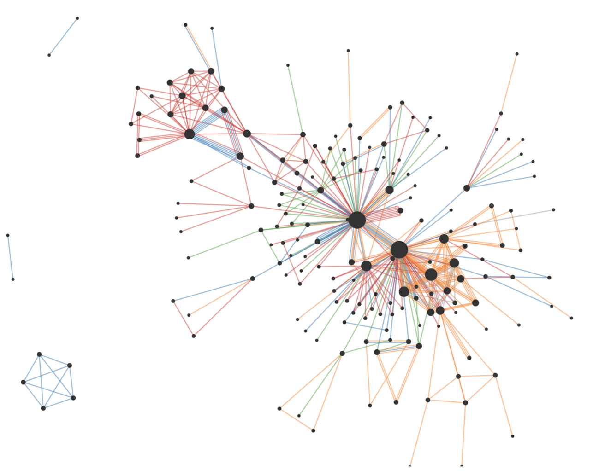

Below, a list of patterns we can find in this network.

* 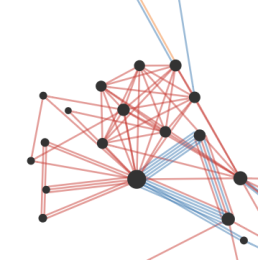    **Cluster**: Group of densely connected nodes.
* 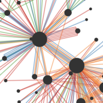    **Central nodes**, highly connected nodes with many connections.
* 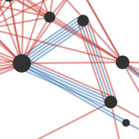    **Triangle** motif with multiple connections.
* 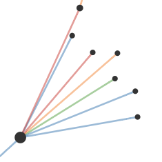    **Fan:** central node connected to many individual nodes. -->

# Circular Node-link Diagram and Arc Diagram

|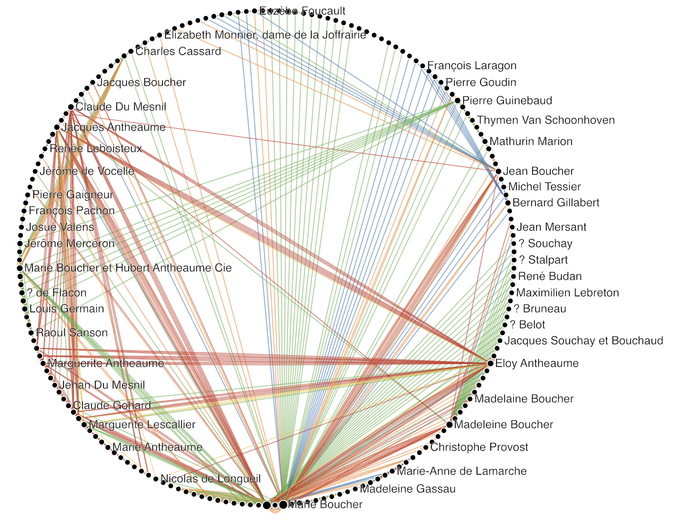|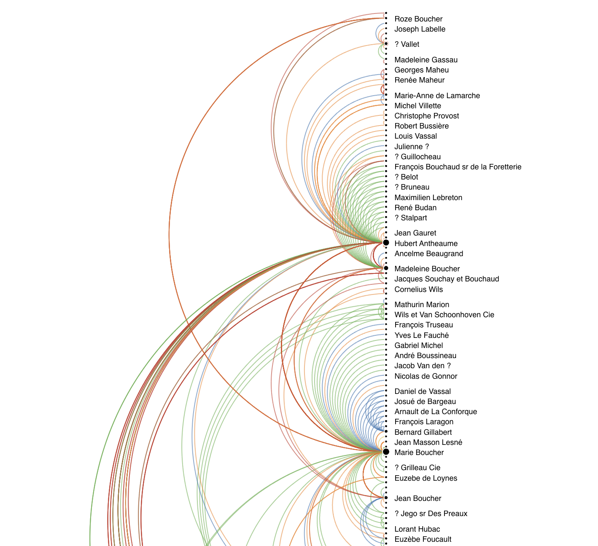|

Circular node-link diagrams and arc diagrams show nodes in a network along a linear ordering on a circle with straight lines (Circular node-link) or along a vertical line with arcs (Arc diagram) respectively. 

The method to order nodes can be chosen form a drop-down menu and includes those main options: 
* An optimization method (Optimal-leaf ordering, Barycenter heuristic, Bandwidth reduction, PCA), or
* Node degree

### Visual Encoding

* **Node size (default):** Number of connections: Larger nodes indicate nodes with more connections, smaller nodes have less connections (node degree).
* **Multiple lines between nodes (optional, only in the Circular node-link not in the Arc Diagram):** this indicates multiple different relations among those nodes.
* **Line thickness (optional):** relation weight: lines of different thickness indicate relations of different strength (or weight).
* **Line color (optional):** relation type: Different colors mean different types of relation. A color legend is presented in the Browser (see below).
* **Node color or shape (optional):** node colors or shapes indicate node types. Node types show as symbols (circles, squares, crosses, etc. ) when links also do have a type and are consequently colored. If links in the network do not have color, node type is shown through colors. 

### Interaction
* **Zoom:** Move mouse wheel (or use the specific zooming gesture on your device)
* **Pan:** Drag on the empty plane with the mouse
* **Show node label and a node's neighbor** by hovering over a node. 
* **Style sliders** 
    * Node size, node opacity, 
    * Link width, link opacity, 
    * Label density (the number of labels being shown)
    * Label size
    * Link gap: the gap between parallel links (links between the same node pair)
* **Timeline slider** (if the data has temporal information)

# Adjacency Matrix

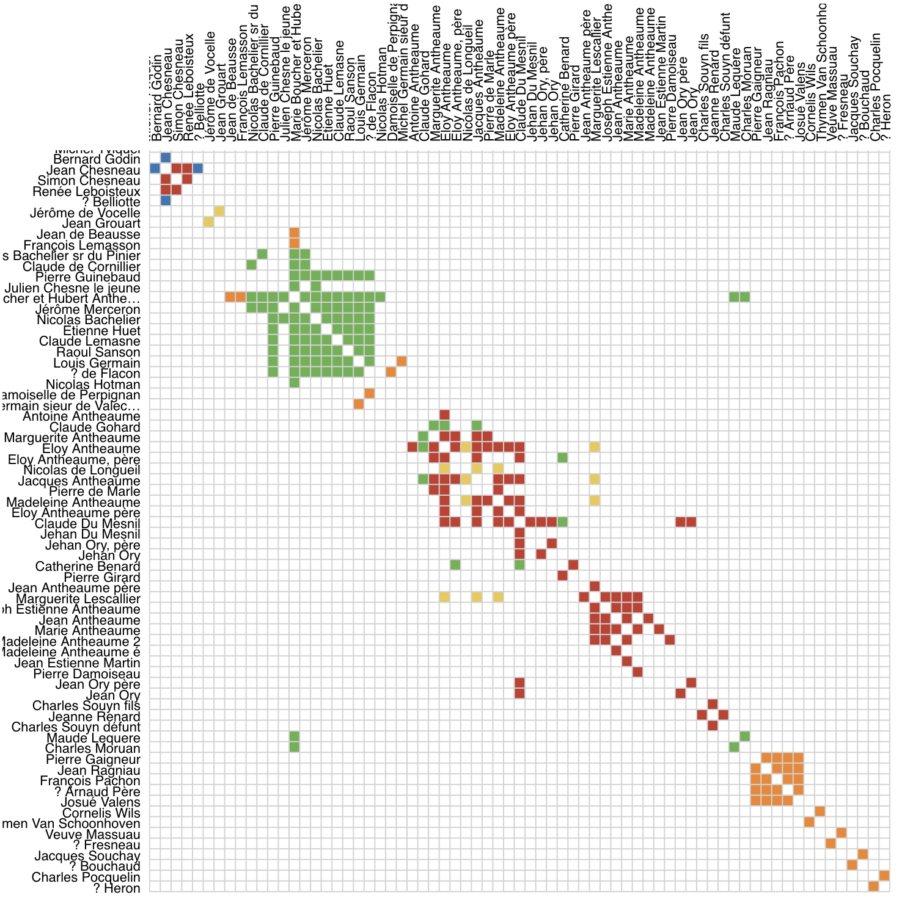

[Adjacency matrices](https://visualizationcheatsheets.github.io/matrix.html) (or simply matrices) are table representations of networks. Nodes are represented both as rows and columns, connections are shown as marks in the corresponding cells at the intersection of row and column. Contrary to node-link representations, matrices do not suffer from visual clutter if the network is dense (i.e. contains many links). Matrices help you explore dense networks that would look too cluttered with node-link diagrams. Node labels are shown for rows and columns. 

The method to order nodes can be chosen from a drop-down menu and includes those main options: 
* An optimization method (Optimal-leaf ordering, Barycenter heuristic, Bandwidth reduction, PCA), or
* Node degree, Node label

### Visual Encodings
* **Squared cells = connections**: Squared cells indicate connections with a positive weight. If no connection weight is specified in the data, the default weight is set to 1.
<!-- * **Diamond cells = connections with negative weight**: e.g. to show negative correlation between brain regions.
* **Split cells = multiple connections between nodes**: some squared matrix cells are split into vertical bars. This means that more than one connection exists between the two nodes represented by the row and column. -->
* **Cell color = connection type**: Different colors mean different types of relation. A color legend is presented in the Browser (see below).

### Interaction
* **Zoom** :mouse wheel
* **Pan**: drag and drop on matrix
* **Timeline slider** (if the data has temporal information)
<!-- * **Show connection weight**: hover cell -->

<!-- ### Parameters
* **Label Ordering:** Defines the ordering of rows and columns
    * **Alphanumerical**: Order by name
    * **Reverse Alphanumerical**: by name, reversed
    * **Node degree**: according to number of connections, descending
    * **Similarity**: groups nodes with similar connectivity to reveal patterns in the matrix. -->

<!-- ### Visual Patterns

Visual patterns inside the matrix are defined by a [reordering algorithm](https://hal.inria.fr/hal-01326759/document), optimizing row and column ordering of the matrix. Vistorian uses one of these algorithms called Leaf-ordering, implemented in [reorder.js](https://github.com/jdfekete/reorder.js/). Choosing 'Similarity' from the order menu optimizes row and column ordering, based no the currently visible links. I.e., only links present in the current temporal selection will be taken as basis for the reordering. That means that the ordering can be optimized for individual time periods as clusters might be present at specific periods only.

Matrices contain potentially a [variety of patterns](https://hal.inria.fr/hal-01326759/document). The four most important are the following ones:

* 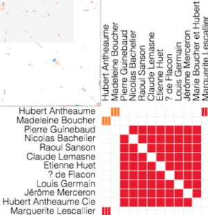  **Squares along the diagonal** of the matrix indicate groups of densely connected nodes in the network; each node indicated in the rows is connected to each node in the column.
* 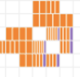   **Incomplete squares along the diagonal** are almost squares but are missing some cells, i.e. not all nodes in the rows are connected to all nodes in the columns. Such incomplete squares are **clusters of densely connected nodes**. 
*    **Complete or incomplete squares off the diagonal indicate bigraphs**. In bigraphs nodes from one set are only connected to nodes from the other set. In the figure from the left (almost all) nodes in the rows are connected to (almost all) nodes in the columns.
* The last of the main patterns are **dense rows or columns**: 

    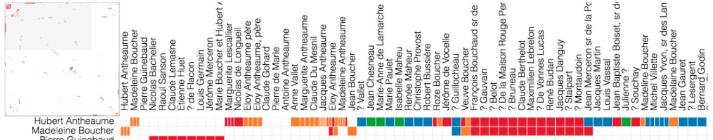

    a row or column with lots of cells indicates a highly connected node. In the figure just above, the node Hubert Antheaume is connected almost all the nodes in the visible columns. The node can be called a **hub**.
 -->

# Time Arcs

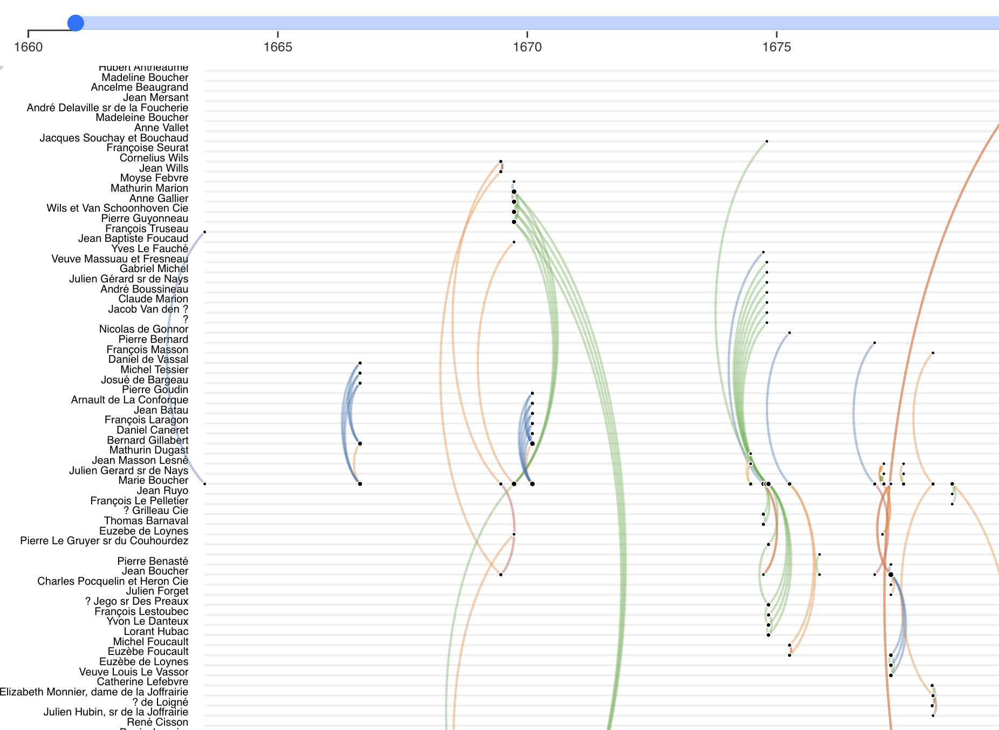

The time arcs show nodes as vertical list (top left) and time along the horizontal axis. Arcs represent links between two nodes at different locations. Link direction is indicated by the clock-wise direction of arcs. I.e., an arc bending to the left side goes from a lower node in the list to an upper one; an arc bending right goes from a node higher in the list to a lower one.

### Visual Encoding
* **Arc:** Link between two persons at a given moment in time.
* **Arc colors:** Different colors mean different types of relation. A color legend is presented in the Browser (see below).
<!-- * **Numbers in brackets at node labels:** Node degree (number of connections). -->

### Interaction
* **Zoom:** Move mouse wheel (or use the specific zooming gesture on your device)
* **Pan:** Drag on the empty plane with the mouse
* **Show node label and a node's neighbor** by hovering over a node. 
* **Style sliders** 
    * Node size, node opacity, 
    * Link width, link opacity, 
    * Label size
* **Timeline slider** (if the data has temporal information)

# Adjacent-node List

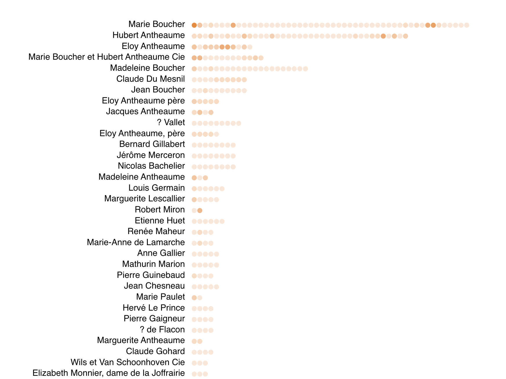

This visualization shows nodes (in a vertical list) alongside each node's neighbors horizontally. Each circle is one neighbor.

### Visual Encoding
* **Node color (optional):** type of that node, if the data set has node types.

### Interaction
* **Zoom:** Move mouse wheel (or use the specific zooming gesture on your device)
* **Pan:** Drag on the empty plane with the mouse
* **Style sliders** 
    * Label size
* **Timeline slider** (if the data has temporal information)

# Incident-link List

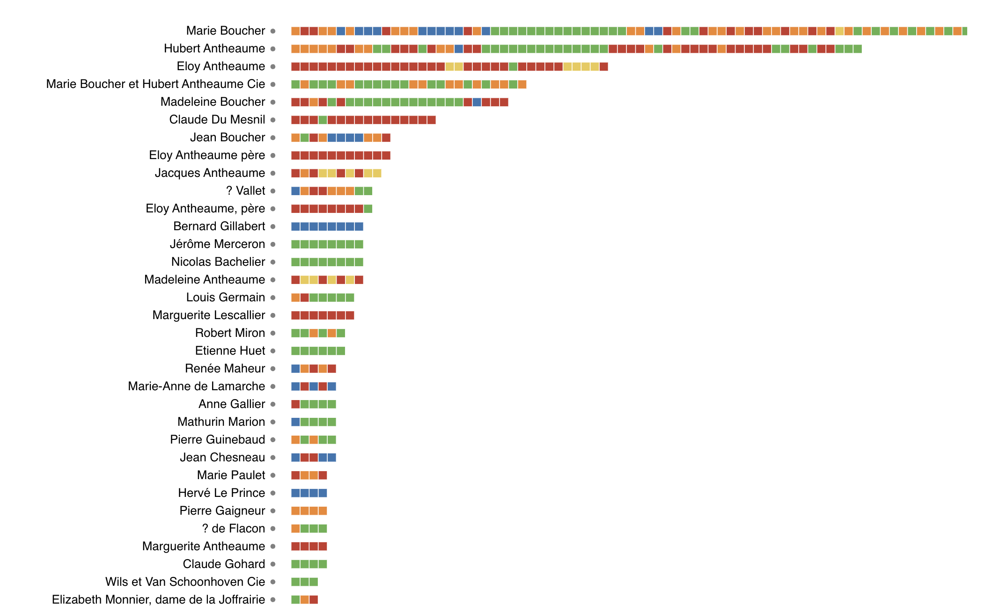

TThis visualization shows nodes (in a vertical list) alongside each node's links horizontally. Each circle is one neighbor

### Visual Encoding
* **Link color (optional):** type of that link, if the data set has node types. 

### Interaction
* **Zoom:** Move mouse wheel (or use the specific zooming gesture on your device)
* **Pan:** Drag on the empty plane with the mouse
* **Hover** a link to see start node, end node and eventual link type
* **Style sliders** 
    * Label size
* **Timeline slider** (if the data has temporal information)

# Geographic Map

<!--  -->

The map visualization shows a network with nodes having geographic node positions. This requires that nodes have geographic coordinates associated with them in the data model. Every dot-node on the map represents a position of an actual node in the network. If nodes move over time, each dot is a node at some point in time, i.e., nodes are duplicated. 

### Visual encodings
* **Node size (default):** Number of connections: Larger nodes indicate nodes with more connections, smaller nodes have less connections (node degree).
* **Multiple lines between nodes (optional):** this indicates multiple different relations among those nodes.
* **Line thickness (optional):** relation weight: lines of different thickness indicate relations of different strength (or weight).
* **Line color (optional):** relation type: Different colors mean different types of relation. A color legend is presented in the Browser (see below).
* **Line color (optional):** relation type: Different colors mean different types of relation. A color legend is presented in the Browser (see below).

<!-- # Element Browser
If you have multiple types of links, the browser contains a legend for each type of link. You can hide and recolor links.

The browser has also a search option. -->
